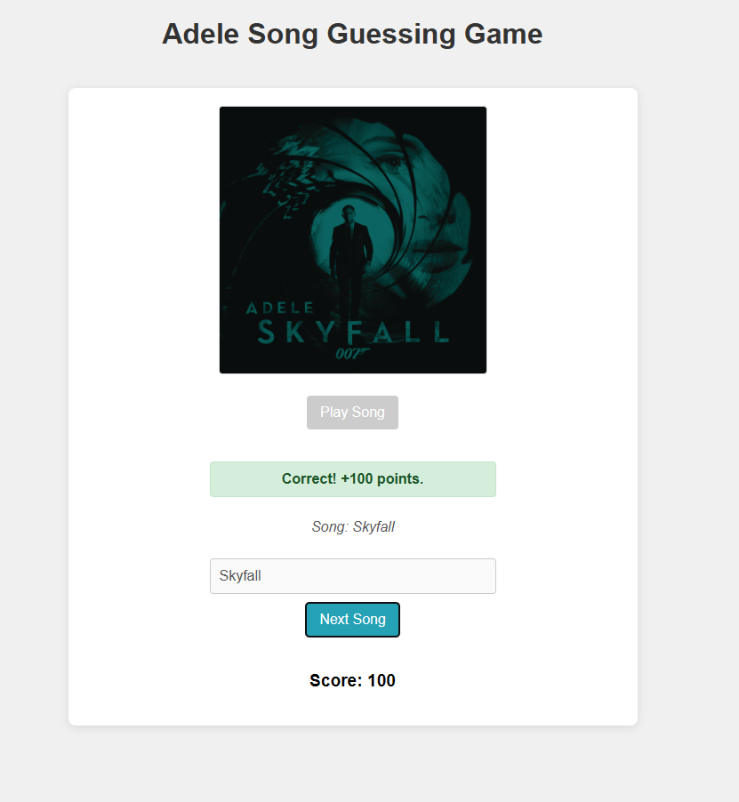
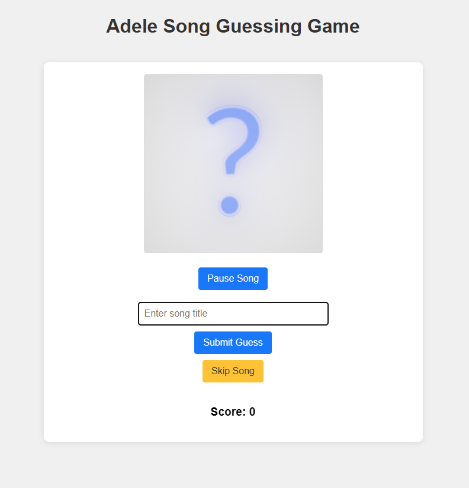

# Adele Song Guessing Game

## Description
This is a web-based song guessing game where users listen to songs by Adele and try to guess the title. The game features dynamic scoring based on how quickly the user guesses, autoplay of songs, and displays album art once a song is guessed or skipped.

## Features
*   Guess song titles by Adele.
*   Songs autoplay at the start of each round.
*   Full song playback (or until guessed/skipped).
*   Dynamic scoring: More points for faster correct guesses.
*   Album art and song title revealed after each round.
*   Play/Pause functionality for the current song.
*   Skip song option.
*   Game over screen with final score.





## Setup Instructions

This project requires the user to supply their own Adele music files and a corresponding `songs.json` file due to copyright restrictions on distributing music.

1.  **Clone the Repository (or download the files):**
    ```bash
    git clone git@github.com:CasparN/adeleguessr.git
    cd adele-song-guessing-game 
    ```
2.  **Music Directory Setup:**
    *   Create a directory named `music` in the root of the project.
    *   Inside the `music` directory, create subdirectories for each Adele album you want to include (e.g., `Adele - 19 (2008)`, `Adele - 21 (2011)`, etc.).
    *   Place the song files (e.g., `.flac`, `.mp3`) for each album into their respective album directories.
    *   For each album directory, add a `cover.jpg` image file that will be used as the album art.

    Expected `music` directory structure:
    ```
    Adele/
    ├── music/
    │   ├── Adele - 19 (2008)/
    │   │   ├── 01. Song Title.flac
    │   │   ├── 02. Another Song.mp3
    │   │   └── cover.jpg
    │   ├── Adele - 21 (2011)/
    │   │   ├── 01. Song Title.flac
    │   │   └── cover.jpg
    │   └── ... (other albums)
    ├── css/
    ├── js/
    ├── index.html
    ├── songs.json  <-- You will create this
    └── README.md
    ```

3.  **`songs.json` Creation:**
    *   In the root of the project, create a file named `songs.json`.
    *   This file will contain an array of objects, where each object represents a song.
    *   Each song object **must** have the following properties:
        *   `id`: A unique number for the song.
        *   `title`: The exact title of the song (this is what the user's guess will be checked against).
        *   `filePath`: The relative path to the song file from the root of the project (e.g., `"music/Adele - 19 (2008)/01. Adele - Daydreamer (Explicit).flac"`).
        *   `album`: The name of the album (e.g., `"19"`).
        *   `albumCoverPath`: The relative path to the album's cover image (e.g., `"music/Adele - 19 (2008)/cover.jpg"`).
    *   Optionally, for songs with long or complex titles, you can add an `alternativeTitles` array:
        *   `alternativeTitles`: An array of strings, where each string is a simpler or alternative title that will also be accepted as a correct guess (e.g., `["Send My Love"]`).

    Example `songs.json` entry:
    ```json
    [
      {
        "id": 1,
        "title": "Daydreamer",
        "filePath": "music/Adele - 19 (2008)/01. Adele - Daydreamer (Explicit).flac",
        "album": "19",
        "albumCoverPath": "music/Adele - 19 (2008)/cover.jpg"
      },
      {
        "id": 25,
        "title": "Send My Love (To Your New Lover)",
        "filePath": "music/Adele - 25 (2015)/02. Adele - Send My Love (To Your New Lover).flac",
        "album": "25",
        "albumCoverPath": "music/Adele - 25 (2015)/cover.jpg",
        "alternativeTitles": ["Send My Love"]
      }
      // ... more songs
    ]
    ```
    **Important:** Ensure all file paths in `songs.json` are correct and use forward slashes (`/`) as path separators.

## Running the Game
Once you have set up the `music` directory and created the `songs.json` file:
1.  Open the `index.html` file in your web browser.
2.  The game should load, and you can click "Start Game" to begin.

## Technologies Used
*   HTML5
*   CSS3
*   JavaScript (ES6 Modules)

Enjoy the game!
